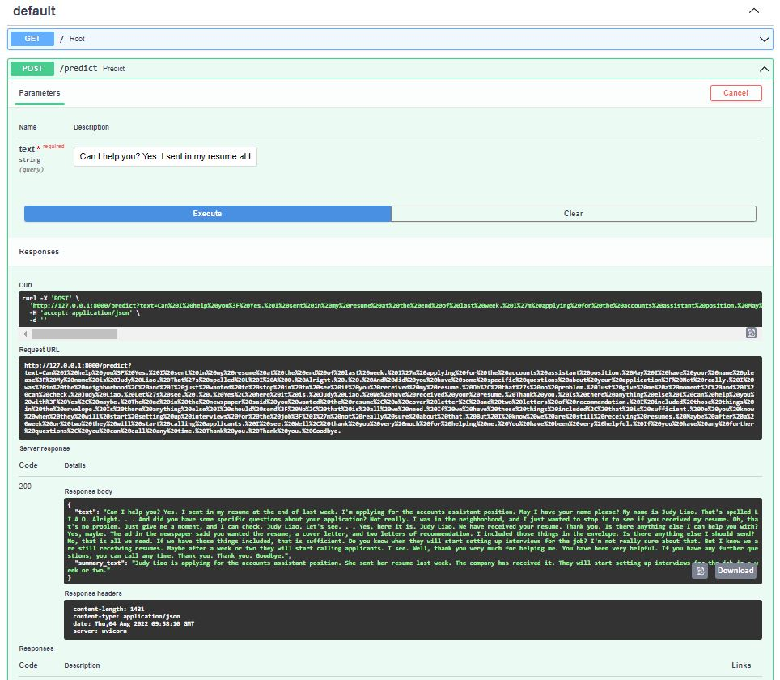

# Abstractive Summarization with Pre-trained Language Models
A demo on utilizing pre-trained language models to carry out abstractive summarization on conversations.

## Installation
First, clone the repository to a folder of your choice (after installing git).

Next install the necessary dependencies and libraries

1. Install the following dependencies:
   - Anaconda

2. Create an environment with a specific version of Python and activate the environment
   ```
   conda create -n <env name> python=3.7.13
   ```

3. Install libraries in environment.yml file
   ```
   conda env create -f environment.yml
   ```

Currently, two different models are implemented to carry out the summarization task. To run the streamlit demo, activate the conda environment created and in the code directory, run the following line of code with the name of the model as the --model argument: 
```
streamlit run app/app.py -- --model bartmeeting
```
or
```
streamlit run app/app.py -- --model pegasus
```

Currently for conversation summarization, the pre-trained "bartmeeting" option performs better. On the first startup of the app, it takes a while for the script to completely download all the model artifacts from the server. The download happens only for the first time the app runs on the machine.

## API Deployment  
Besides the Streamlit demo, the summarizer can also be deployed as an API in a docker container. You might need to increase the Memory limits used by Docker (via Docker Desktop -> Settings -> Resources -> Advanced -> Memory Slider) 

To build the docker container run the following code in the main directory where the "Dockerfile" is located:
```
docker build -t abs_sum_api -f Dockerfile --no-cache .
```

Next, run the docker container (the model artifact will be downloaded from the online repository each time the container is created):
```
docker run -p 8000:8000 abs_sum_api
```

To check the running container, run the following code:
```
docker exec -it <insert_container_name> /bin/bash
```

Great, the API is now accessible on http://127.0.0.1:8000. To test out the API, go to http://127.0.0.1:8000/docs#. Fill in the text parameter to summarize to return the results! <br><br>.



## Code Structure
This section has some explanations about the different directories.
- app: contains scripts and assets for the UI
- summarizer: contains the models used for the summarization task

For more information about the tools used, please refer to the following link:
- https://streamlit.io/
- https://www.anaconda.com/products/distribution
- https://huggingface.co/docs/transformers/index


## Version
v1.1